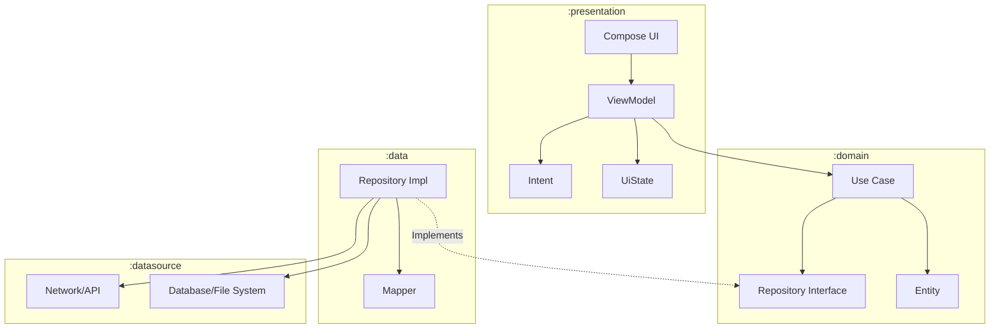

# CAMMP (Clean Architecture Multi-Module Plugin)

[](https://plugins.jetbrains.com/plugin/29447)
[](https://plugins.jetbrains.com/plugin/29447)
[](https://github.com/jkjamies/CAMMP/actions?query=workflow%3ABuild)
[](https://codecov.io/gh/jkjamies/CAMMP)
[](https://www.paypal.com/paypalme/jkjamies)

> **The Architectural Guardian for Android Development.**

<!-- Plugin description -->
CAMMP is **not** just a code generator; it is a strict enforcement of Clean Architecture principles. It eliminates "Shift-Left" fatigue by automating the repetitive setup of modules, dependency injection, and testing harnesses, allowing you to focus purely on business logic.

When you create a feature with CAMMP, you aren't just getting files; you're getting a fully wired, compiling, and tested architectural vertical slice.
<!-- Plugin description end -->

---

## 🏛 Architectural Master Plan

CAMMP enforces a strict implementation of **Clean Architecture** combined with **MVI** (Model-View-Intent) for presentation logic.



### The "Holy Grail" Separation of Concerns
| Layer | Role | Dependency Rule |
|-------|------|-----------------|
| **`:domain`** | **The Core**. Pure Kotlin entities, use cases, and interfaces. | **DEPENDS ON NOTHING.** |
| **`:data`** | **The Implementation**. Repositories, mappers, DTOs. | Depends on `:domain` & `:datasource`. |
| **`:datasource`** | **The I/O**. Low-level file system, network, or hardware access. | Knows **nothing** of business logic. |
| **`:presentation`** | **The Interaction**. MVI ViewModels, UI State, Compose screens. | Depends on `:domain`. **NEVER** `:data`. |

### Advanced Configuration: The API Split
For complex multi-module projects, you can opt to split the Domain layer to improve build times and separation:
*   **`:api`**: Contains only Interfaces and Entities. Dependencies are lighter.
*   **`:domain`**: Contains Use Case implementations.

This ensures that changes to use case logic do not force recompilation of modules that only depend on the entities/interfaces.

---

## 🚀 Features

### ⚡ Automated Scaffolding
Stop copy-pasting `build.gradle.kts` files. CAMMP generates the entire module structure with:
*   **Version Catalog Integration**: Automatically wires dependencies from `libs.versions.toml`.
*   **Test Harness**: Sets up Kotest, MockK, and Turbine by default.
*   **DI Modules**: Scaffolds Metro, Hilt or Koin modules to bind implementations to interfaces.

### 💾 Data Source Strategies
CAMMP respects that not all repositories are created equal. Choose a strategy that fits your data needs:
*   **Combined**: A simple, single DataSource interface for basic CRUD.
*   **Local & Remote (Split)**: Generates distinct `LocalDataSource` (e.g., Room) and `RemoteDataSource` (e.g., Retrofit) interfaces.
*   **Local Only**: For offline-first or settings repositories.
*   **Remote Only**: For API-only repositories.

### 🔧 Modern Tech Stack Support
Support for the bleeding edge of Android & KMP development:
*   **Language**: Kotlin 2.3.0+
*   **UI**: Jetpack Compose (Jewel Theme for Plugin UI)
*   **Dependency Injection**:
    *   **Metro**
    *   Google **Hilt**
    *   **Koin**
    *   **Koin Annotations**
*   **Testing**: Kotest (BDD), MockK, Turbine

### 🧩 Generators
1.  **Feature Generator**: Creates the full vertical slice (`:domain`, `:data`, `:presentation`, `:datasource`).
2.  **Repository Generator**: Creates `Repository` interfaces and implementations, ensuring they land in the correct layers.
3.  **Use Case Generator**: Scaffolds domain logic.
4.  **Presentation Generator**: Sets up the MVI loop (State, Intents, ViewModels).

---

## 📂 Project Structure

CAMMP enforces a standard, easy-to-navigate module structure:

```text
feature-name/
├── api/               # (Optional) Interfaces & Entities
├── domain/            # Pure Kotlin: Use Cases, Repositories
├── data/              # Implementation: Repository Impls, Mappers
├── datasource/        # I/O: FileSystem, Network, Preferences
└── presentation/      # UI: ViewModels, Screens (Compose), States
```

---

## 🛠 Getting Started

### Prerequisites
*   IntelliJ IDEA or Android Studio
*   A project using **Gradle Version Catalogs**

### Installation
1.  Install the plugin from the [JetBrains Marketplace](https://plugins.jetbrains.com/plugin/29447).
2.  Restart your IDE.

### Usage

#### IntelliJ Plugin
1.  Open the **CAMMP** tab in the IDE tool window.
2.  Navigate to the **Generate Feature** tab.
3.  Enter your feature name (e.g., `Authentication`).
4.  Select your **Data Source Strategy** and other options.
5.  Click **Generate**.
6.  Sync Gradle.

#### Claude Code Skills
CAMMP provides two Claude Code skills for generating Clean Architecture modules directly from your terminal:

1.  **`/cammp-mcp`** - Uses the CAMMP MCP server (requires `cammp-mcp.jar` configured as an MCP server).
2.  **`/cammp`** - Standalone skill that generates all files directly (no MCP server required).

**Installation:**
1.  Download `cammp-skill.zip` or `cammp-mcp-skill.zip` from the [latest release](https://github.com/jkjamies/CAMMP/releases).
2.  Extract into your project's `.claude/skills/` directory or `~/.claude/skills/` for global access.
3.  Use `/cammp login` or `/cammp-mcp login` in Claude Code to generate a feature.

#### MCP Server
1.  Download `cammp-mcp.jar` from the [latest release](https://github.com/jkjamies/CAMMP/releases).
2.  Configure it as an MCP server with stdio transport: `java -jar cammp-mcp.jar`
3.  Use the `generate_feature` tool from any MCP client.

---

## 📜 License

```text
Copyright 2025-2026 Jason Jamieson

Licensed under the Apache License, Version 2.0 (the "License");
you may not use this file except in compliance with the License.
You may obtain a copy of the License at

    http://www.apache.org/licenses/LICENSE-2.0

Unless required by applicable law or agreed to in writing, software
distributed under the License is distributed on an "AS IS" BASIS,
WITHOUT WARRANTIES OR CONDITIONS OF ANY KIND, either express or implied.
See the License for the specific language governing permissions and
limitations under the License.
```
